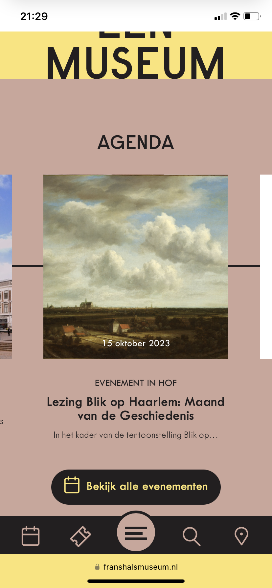
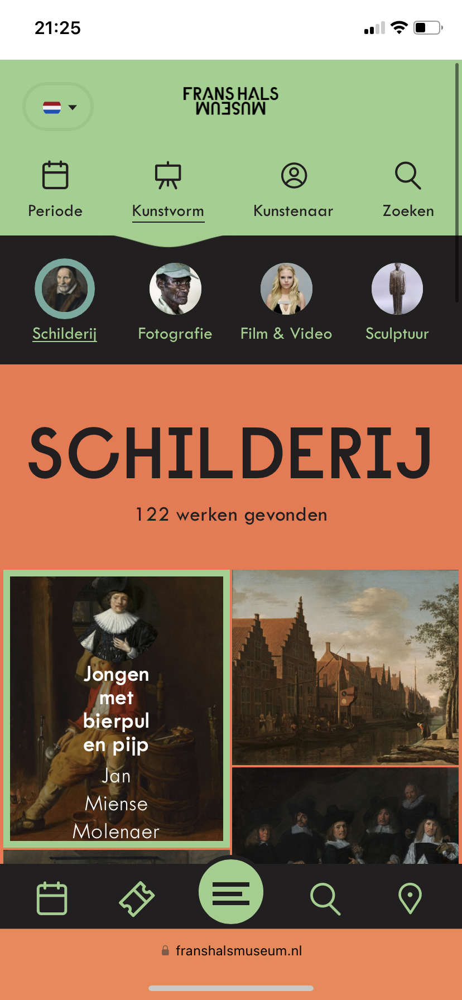
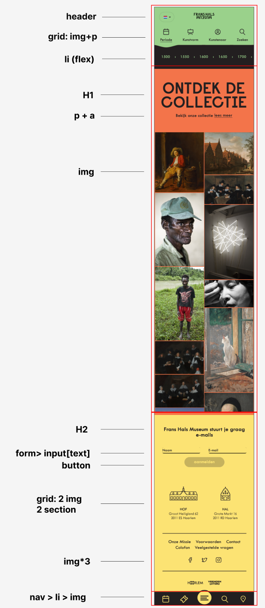
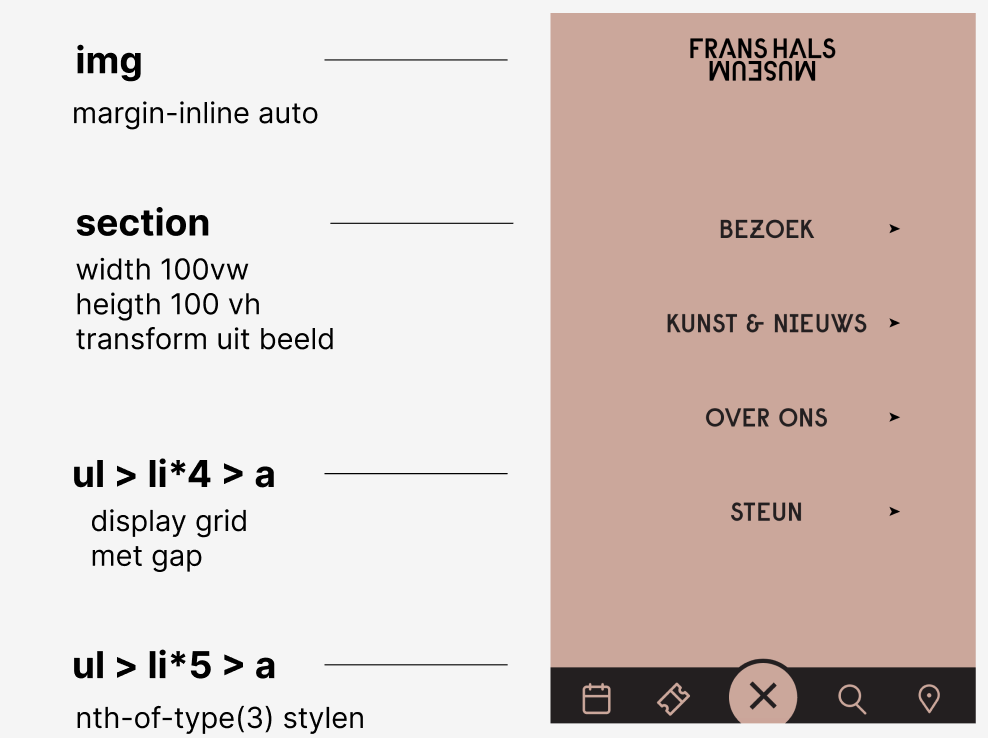
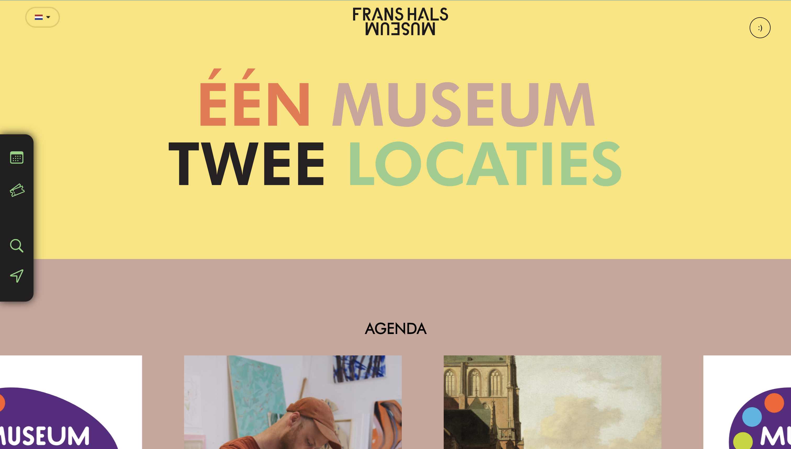
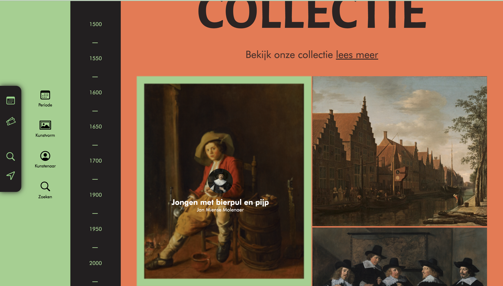
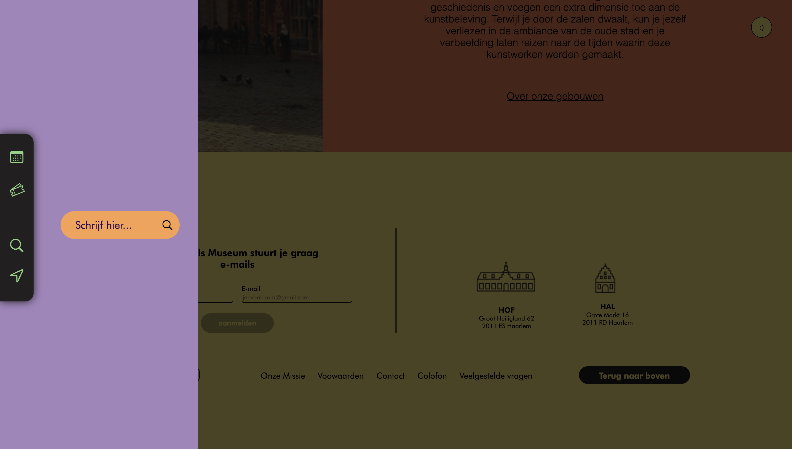
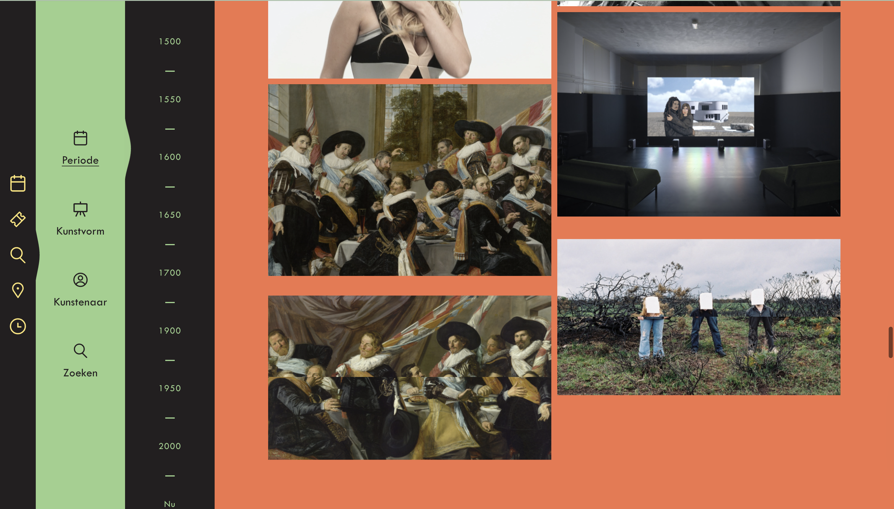

# Procesverslag
Markdown is een simpele manier om HTML te schrijven.  
Markdown cheat cheet: [Hulp bij het schrijven van Markdown](https://github.com/adam-p/markdown-here/wiki/Markdown-Cheatsheet).

Nb. De standaardstructuur en de spartaanse opmaak van de README.md zijn helemaal prima. Het gaat om de inhoud van je procesverslag. Besteedt de tijd voor pracht en praal aan je website.

Nb. Door *open* toe te voegen aan een *details* element kun je deze standaard open zetten. Fijn om dat steeds voor de relevante stuk(ken) te doen.

## Jij

  
uitwerken voor kick-off werkgroep

  ### Auteur:
  Niels Bakker

  #### Je startniveau:
  Rood

  #### Je focus:
  Ik ga focussen op de surface plane. 
 

## Je website

  
uitwerken voor kick-off werkgroep

  ### Je opdracht:
  https://www.franshalsmuseum.nl/nl/

  #### Screenshot(s) van de eerste pagina (small screen): 
  Homepagina 
  

  #### Screenshot(s) van de tweede pagina (small screen):
  Ontdek de collectie 
  
 

## Toegankelijkheidstest 1/2 (week 1)

  
uitwerken na test in 2e werkgroep

  ### Bevindingen
  Lijst met je bevindingen die in de test naar voren kwamen:

   Website: Frans Hals Museun | Ingevuld door Binc van Buren

   - knoppen zijn goed uitgeschreven en de website bevat duidelijke taal
   - bij het roteren van de website overlappen sommige elementen over elkaar heen
   - titel nog speciek maken voor de pagina 
   - het navigeren tussen de focus states gaat nog niet helemaal soepel
    waarbij de volgorde verwarrrend is of dat je niet ziet waar de focus zit.
   - beide pagina's bevatten één enkele h1 en de heading volgorde is goed 
   - alt teksten nog toevoegen bij images 

## Breakdownschets (week 1)

  
uitwerken na afloop 3e werkgroep

  ### de hele pagina: 
  

  ### dynamisch deel (bijv menu): 
  

## Voortgang 1 (week 2)

  
uitwerken voor 1e voortgang

  ### Stand van zaken
  
  Ik ben goed op weg. Ik merk dat ik veel van de stof al redelijk goed beheers en dus kan ik veel tijd 
  spenderen aan mijn website ipv aan de opdrachten. Ik heb de layout en de vormgeving van mijn eerste pagina
  zo goed als af en dus lig ik, volgends Vasilis, 'op schema'. Ik loop tot nu toe tegen geen problemen aan. 
  Mijn volgende prioriteit is het opzetten en opmaken van de tweede pagina met HTML & CSS. 

  ### Agenda voor meeting
  samen met je groepje opstellen

  | student 1      | student 2          | student 3    | student 4        |
  | ---            | ---                | ---          | ---              |
  | persoonlijke   | persoonlijke       | persoonlijke | persoonlijke     |
  | vraag          | vraag              | vraag        | vraag            |

  ### Verslag van meeting
  hier na afloop snel de uitkomsten van de meeting vastleggen

  - verbeterde UX van mijn forum sectie door labels toevoegen zodat je tijdens het typen deze nog kan zien
  - geleerd over goed gebruik van margin's (inline, block)
  - css netjes houden en gebruikmaken van custom properties

## Voortgang 2 (week 3)

  
uitwerken voor 2e voortgang

  ### Stand van zaken

  Ik heb nog steeds veel plezier in het coderen en heb dus tijdens de les, maar ook buiten schooltijd, 
  veel gewerkt aan mijn site. De basis van de eerste 2 pagina's is nu klaar. Ik merk wel dat hoe meer
  HTML en CSS ik schrijf, des te vaker dat er dingen breken in mijn website. Vaak was het makkelijk op te lossen
  maar wel even zoeken tussen alle CSS. Daarom ben ik extra gaan focussen op het opruimen en netjesh ouden van mijn CSS. Mijn volgende prioriteit is de surface plane - mijn gekozen focus. Daarnaast zijn de twee pagina's die ik heb
  gemaakt al aardig responsive. Ik ga dus verdiepen in animaties, hovers, thema's en JavaScript. 

  ### Agenda voor meeting
  samen met je groepje opstellen

  | student 1      | student 2          | student 3    | student 4        |
  | ---            | ---                | ---          | ---              |
  | persoonlijke   | persoonlijke       | persoonlijke | persoonlijke     |
  | vraag          | vraag              | vraag        | vraag            |

  ### Verslag van meeting
  hier na afloop snel de uitkomsten van de meeting vastleggen

 - veel HTML & CSS 
 - nette, semantische code 
 - goed gebruik van kopjes om CSS te sorteren
 - je gebruikt custom properties; je kunt nog kijken naar een ligt/-dark-mode
 - read.me bijwerken! :)

## Toegankelijkheidstest 2/2 (week 4)

  
uitwerken na test in 9e werkgroep

  ### Bevindingen
  Lijst met je bevindingen die in de test naar voren kwamen (geef ook aan wat er verbeterd is):

  - de volgorde waarmee je door de pagina tabt was nog niet helemaal logisch 
  - alt teksten bij images ontbraken
  - evt. reduce-motion toevoegen om animaties te beperken 
  - sommige linkjes zagen er nog niet uit als linkjes
  - de heading levels waren goed
  - de contrast-ratio was overal voldoende

## Voortgang 3 (week 4)

  
uitwerken voor 3e voortgang

  ### Stand van zaken

  Woensdag hadden we de laatste les van dit vak gehad en dus alle stof behandeld.
  Door goed bij te blijven heb ik alle onderdelen uit de les kunnen verwerken in mijn site. 
  Ik ben dan ook erg tevreden over de huidige status van mijn pagina's en denk dat ik dit weekend kan beginnen
  met het afronden van dit project. Tijdens de toegankelijkheidstest van vorige les kwam ik er achter dat er op
  dit gebied nog veel verbeterd kon worden. Dit was nu mijn prioriteit en hierover had ik enkele vragen. 

  ### Agenda voor meeting

  | student 1      | student 2          | student 3    | student 4        |
  | ---            | ---                | ---          | ---              |
  | persoonlijke   | persoonlijke       | persoonlijke | persoonlijke     |
  | vraag          | vraag              | vraag        | vraag            |

  ### Verslag van meeting
  hier na afloop snel de uitkomsten van de meeting vastleggen

  - tabben door de pagina gaat nu op een logische volgorde 
  - de verborgen menu klapt nu uit wanneer de interactieve elementen hierin focus krijgen (dmv focus-within)
  - UX van de forum sectie verbeterd met type = gmail ipv type = text 

## Eindgesprek (week 5)

  
uitwerken voor eindgesprek

  ### Je uitkomst - karakteristiek screenshots:
  
  

  ### Dit ging goed/Heb ik geleerd: 
  
  Ik vond het leuk om te animeren en hiermee dingen te laten bewegen op hover of click. 
  Hierbij heb ik geoefend met afters, keyframes, transitions, javascript, etc. Een voorbeeld 
  waar ik blij van word is het uitklappen van dit menu. Zodra er op de zoekknop wordt geklikt
  verschijnt het menu vanuit de zijkant in het beeld, terwijl tegelijkertijd de rest van het 
  scherm op de achtergrond donker wordt. Ik vond het gaaf om dit te realiseren en te spelen
  met timing-functions, cubiz-beziers, transform-origin, etc.

  

  ### Dit was lastig/Is niet gelukt:
  
  Iets wat ik graag nog aan mijn website had toegevoegd, maar ik lastig vond en niet was gelukt 
  is het animeren / stylen op basis van scroll. Zo wilde ik bijv. de foto's uit de collectie in 
  laten vliegen zodra deze in beeld kwamen. Dat zie je hieronder op de offiele Frans Hals website. 
  Of de kleur van de svg-iconene aanpassen als de gebruiker naar beneden scrollt. Dit is iets wat
  ik graag nog wil leren omdat ik denk dat het echt iets toevoegdt aan de gebruikerservaring. 

  

## Bronnenlijst

  
continu bijhouden terwijl je werkt

  Nb. Wees specifiek ('css-tricks' als bron is bijv. niet specifiek genoeg). 
  Nb. ChatGpT en andere AI horen er ook bij.
  Nb. Vermeld de bronnen ook in je code.

  1. tekst en afbeeldingen - https://www.franshalsmuseum.nl/nl/
  2. h1 inspiratie - https://codepen.io/alvarotrigo/pen/jOLgeqe
  3. iconen - https://www.flaticon.com

